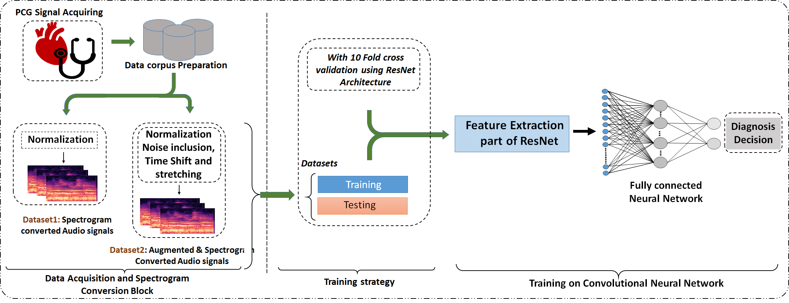
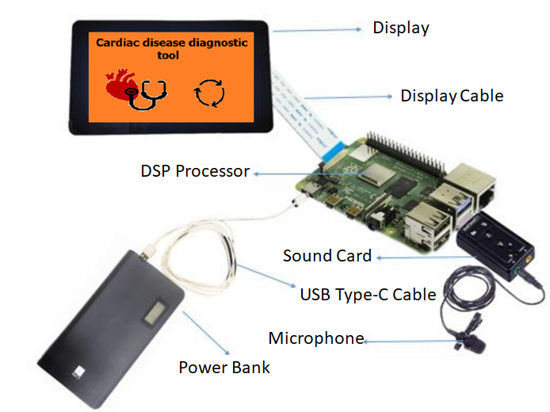
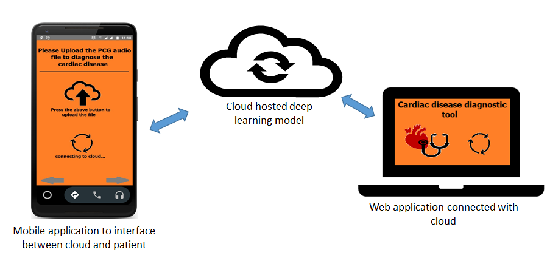

# cardiac-disease-using-phonocardiogram-signal

## Description

A modified ResNet model to detect cardiac diseases by converting phonocardiogram signal into spectrogram.

Please find the code and the dataset for your experiment. 
Hope you find it usefull. 
Experiment with the code and if possible please try to cite the paper using: 

## Workflow

## Processor Hosted

## Web hosted

## Citation

If you use [Cardiac Diseas Code](https://github.com/manojkaushik/Cardiac-disease-using-phonocardiogram-signal) code in your research, we would appreciate a citation to the original paper:

"*Khan, Juwairiya Siraj, Manoj Kaushik, Anushka Chaurasia, Malay Kishore Dutta, and Radim Burget. "Cardi-Net: A deep neural network for classification of cardiac disease using phonocardiogram signal." Computer Methods and Programs in Biomedicine 219 (2022): 106727.*"

"*Khan, J. S., Kaushik, M., Chaurasia, A., Dutta, M. K., & Burget, R. (2022). Cardi-Net: A deep neural network for classification of cardiac disease using phonocardiogram signal. Computer Methods and Programs in Biomedicine, 219, 106727.*"

"*Khan, Juwairiya Siraj, Manoj Kaushik, Anushka Chaurasia, Malay Kishore Dutta, and Radim Burget. "Cardi-Net: A deep neural network for classification of cardiac disease using phonocardiogram signal." Computer Methods and Programs in Biomedicine 219 (2022): 106727.*"

"*Khan, J.S., Kaushik, M., Chaurasia, A., Dutta, M.K. and Burget, R., 2022. Cardi-Net: A deep neural network for classification of cardiac disease using phonocardiogram signal. Computer Methods and Programs in Biomedicine, 219, p.106727.*"

"*Khan JS, Kaushik M, Chaurasia A, Dutta MK, Burget R. Cardi-Net: A deep neural network for classification of cardiac disease using phonocardiogram signal. Computer Methods and Programs in Biomedicine. 2022 Jun 1;219:106727.*"
